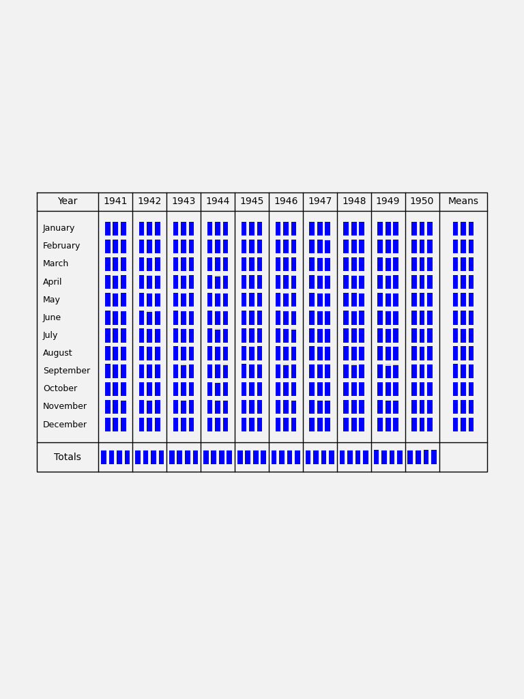

Transcription accuracy by page location
=======================================

   Mean probability of correctness for digits from the test dataset, as transcribed by the tuned convolutional transcriber after 50 epochs training. Partitioned by location in the image. 

Code to make figure

.. literalinclude:: ../../../models/tuned_convolutional_transcriber/validation/PbyPlace.py

